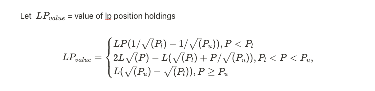
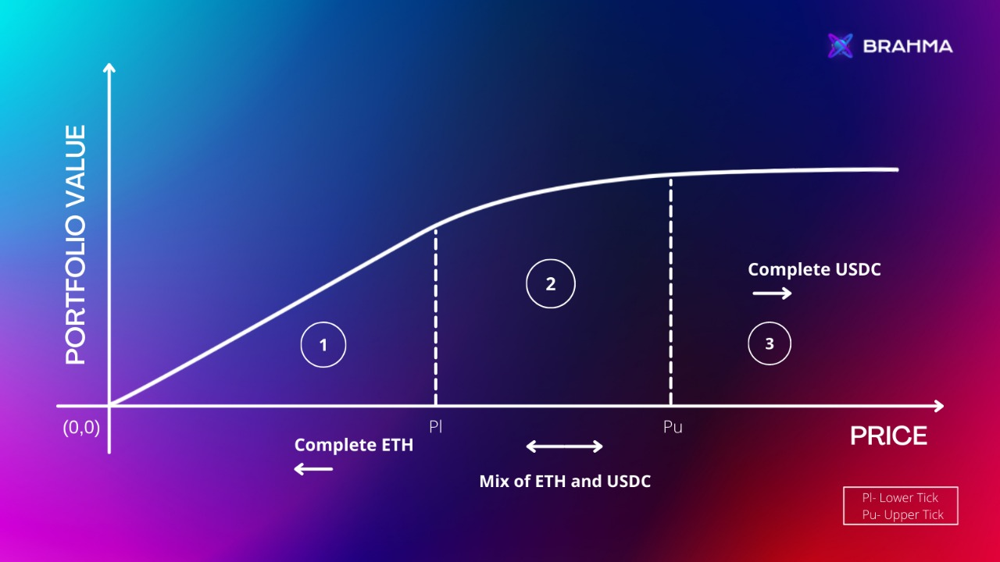

Synthetic ETH PUT selling strategy built on Uniswap V3

---

The first instrument focuses on generating yield by creating synthetic short-put options on Uniswap V3, where users can participate with USDC and get exposure to ETH short put options.

where

L = Liquidity of the position,

P = Current Price,

Pu = Price at upper tick,

Pl= Price at lower tick.

This gives us a payoff structure which can be represented as follows:

An LP's position acts as a synthetic short put option, something you can read more about here. The interesting difference to be noted is that there is no premium paid at the time of taking an LP position on Uniswap V3 as opposed to a normal short put option where you are paid the premium on sale of the option. The premiums for the LP positions are compensated via swap fees.
