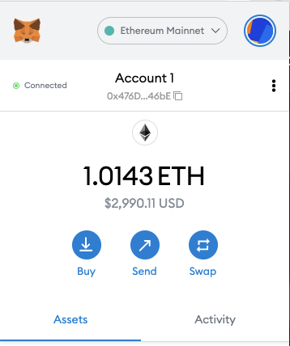
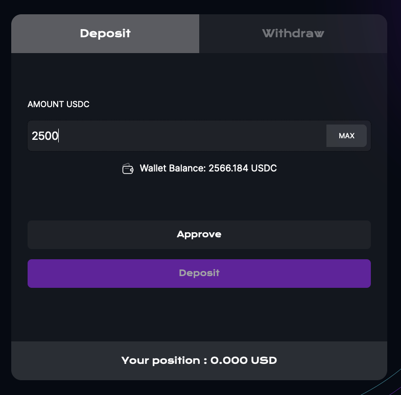
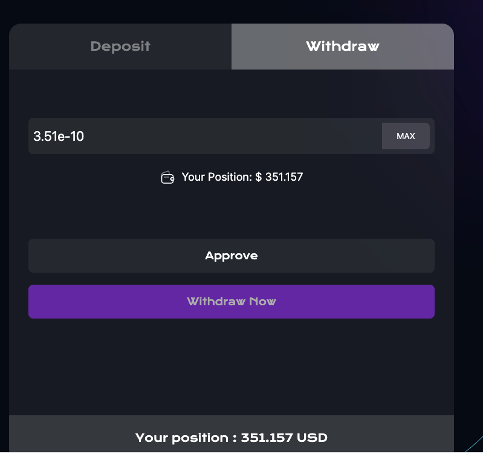

How to interact with AASTRA-ETHPUT

---

1 . Go to app.brahma.fi

2 . Connect with ETH Mainnet on your Metamask

3 . Make sure that you got USDC, as well as ETH to pay for gas fees.

4 . Approve the USDC for spend, as a security practice, we don't allow unlimited spending on the asset.

5 . Post the approval transaction has been validated and confirmed, click on deposit.

6 . After the confirmation on the ETH network, your deposit has been a success and the vault will start deploying the strategies.

7 . You can withdraw your positions anytime by clicking on withdraw and allowing approval and proceeding with Withdraw now.

