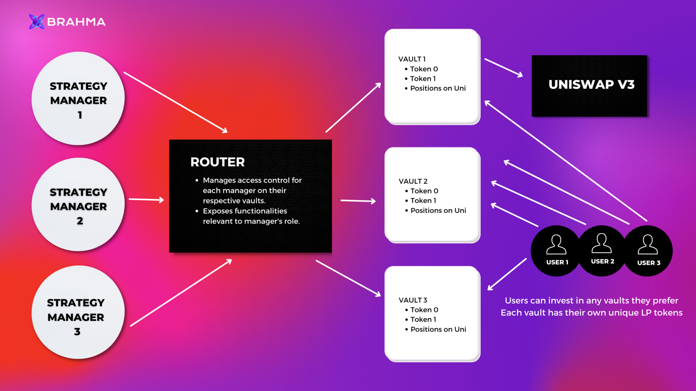

---

We designed Aastra V1 architecture from the grounds up to enable strategy makers to manage vaults with their strategy for users in a permissionless way. Strategy Manager may have no knowledge of solidity and yet be able to call specific functions using our python client to manage funds in the vault (i.e placing orders on Univ3). 

Each vault that gets deployed by us is assigned a strategy manager. Most functionalities dealing with managing funds on the vault are restricted only to the Router contract.‌

The Router also acts as the access control for strategy managers and allows only valid addresses to manage funds of a given vault.‌ All vaults are deployed by the Factory which acts as the single source of truth for retrieving information like the strategy manager of a vault, address of the periphery contract, etc.‌
While the vault has basic functions, which can be used to create new liquidity positions, burn existing ones, and collect fees from Uniswap; the periphery can be used to create custom functionalities and perform multiple operations on Uniswap in one atomic transaction.‌

The router can also be upgraded at any point, and its address updated in the factory to improve existing capabilities leveraging the basic operations already available in the vault.‌

We as a team are currently using our above infrastructure to manage the vaults for our Aastra V1 vault. We are planning to upgrade the architecture, and open up our platform to independent strategist in Brahma V3.